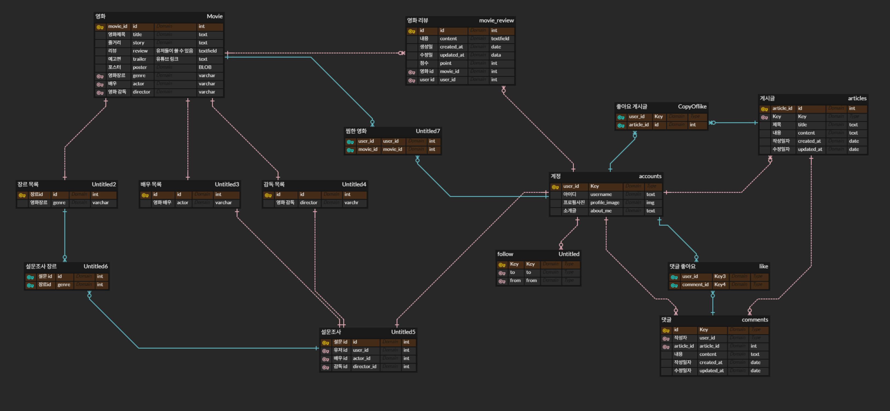

# I. 팀원 정보 및 업무 분담 내역

## 1. 팀원

### 1) 손준배(팀장)

### 2) 공익규

## 2. 업무분담

### : 백, 프론트 둘 다 경험해보고 싶어서 기능별로 분담

### 1) 손준배

### 2) 공익규

+ 영화 검색 기능 구현 및 페이지 구현
+ 영화 리뷰 CRUD 구현 및 페이지

# II. 목표 서비스 구현 및 실제 구현 정도

## 1. 영화 검색시 저장은 서버가, 프론트에서는 화면만 뿌리게 비동기적으로 작동시키고 싶었으나 시간 부족으로 실패

## 2. 게시글에 좋아요 및 회원 구독 기능 추가하여 베스트 게시글 구현하려 했으나 실패함

## 3. 유튜브 트레일러 기능구현 실패함

# III. ERD

# IV. 추천 알고리즘에 대한 기술적 설명

# 

# V. 서비스 대표 기능에 대한 설명

### 1) 영화 검색기능

### 2) 영화 추천기능

# VI. 느낀점

## 우선 기획이 정말 중요하다고 느꼈다. 처음에 DB를 설계할 때 생각보다 너무 오래 걸렸고 DB를 완성하자 마자 바로 프로젝트에 돌입했다. 그래서 프론트의 구성을 짜임새 있게 가져가지 못했고 그 결과 엄청나게 많은 뷰와 컴포넌트들이 만들어졌다. 뷰의 장점인 컴포넌트의 재활용을 거의 하지 못했다. 백에서도 문제가 있었는데 한 명은 데코레이터를 쓰고 한 명은 APIView를 상속받아 클래스 형태로 만들어서 일관성과 가독성이 떨어졌다. 깃을 활용할 때도 계속 충돌이 발생해 하루에 일정 시간은 충돌을 병합하는데 소진했다. 그런 반면에 백과 프론트가 어떻게 데이터를 주고 받는지에 대한 큰 흐름은 알 수 있었고 아주 값진 경험이었다. 다만 정말 아는 게 없다는 걸 느꼈다. chatGPT가 없었다면 지금 보다 훨씬 더 떨어지는 완성도를 보였으리라 예상된다. 이번에 프로젝트가 미완이었던 만큼 추후에도 계속 수정 보완할 것이고, 그 만큼 성장하고 싶다.